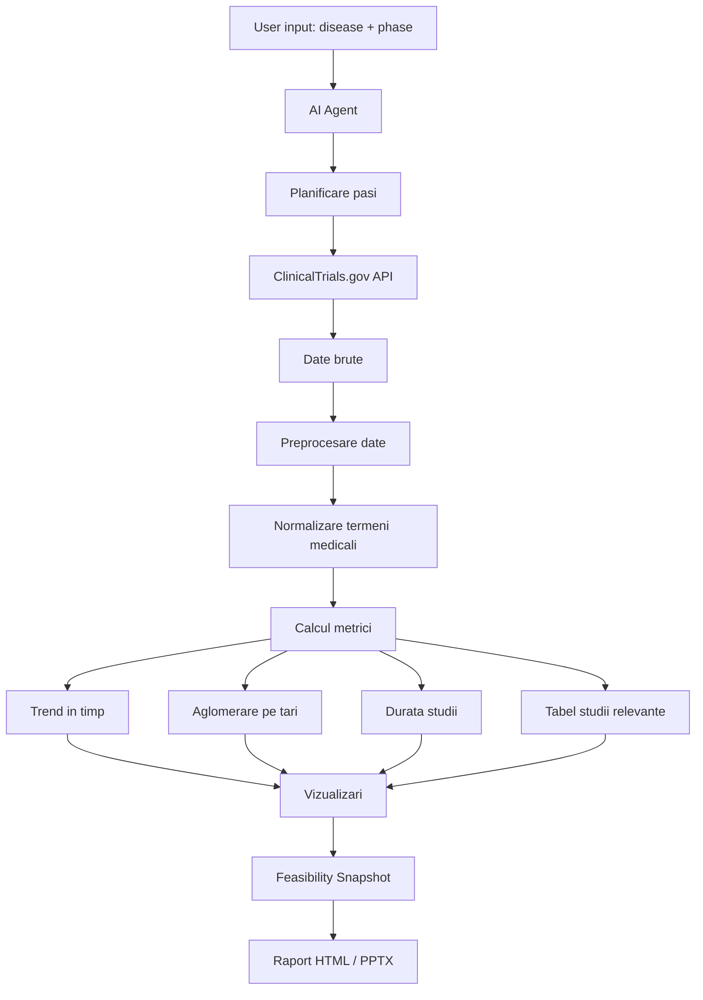

Clinical Trial Radar - analiza fezabilitatii studiilor clinice

Echipa

- Calin Ursoiu
- Vranciu Andra

Despre proiect

Clinical Trial Radar este un sistem inteligent care ajuta la analiza rapida a studiilor clinice pentru o anumita boala si o anumita faza de studiu.

Ideea proiectului a pornit de la faptul ca studiile clinice pot fi intarziate sau pot esua din cauza unor estimari gresite legate de recrutarea pacientilor si de alegerea tarilor sau centrelor potrivite. In mod normal, aceste informatii sunt cautate manual in registre publice si apoi comparate in fisiere Excel.

Aplicatia noastra foloseste date din ClinicalTrials.gov si genereaza automat o imagine de ansamblu asupra studiilor existente: unde se desfasoara, cate sunt active, cate sunt finalizate, cum arata trendul in timp si cat de aglomerata este o anumita regiune din punct de vedere al recrutarii.


Problema rezolvata

Proiectul raspunde la intrebarea:

Pentru o anumita boala si o anumita faza de studiu, cat de fezabil ar fi sa pornim un nou studiu clinic si in ce tari ar exista un risc mai mic?

Sistemul nu inlocuieste decizia unui specialist medical sau operational, dar ofera o baza rapida si standardizata pentru analiza.


Date de intrare

Aplicatia primeste:

- boala analizata, de exemplu diabetes, breast cancer sau covid-19;
- faza studiului, de exemplu Phase 1, Phase 2 sau Phase 3;
- numarul maxim de studii care trebuie analizate;
- optional, tara sau regiunea de interes.


Rezultate generate

Aplicatia poate genera:

- o lista cu studiile clinice relevante;
- un tabel filtrabil cu link catre ClinicalTrials.gov;
- un grafic de trend al studiilor in timp;
- o harta cu distributia studiilor pe tari;
- o metrica de aglomerare pentru recrutare;
- o estimare a duratei obisnuite a studiilor;
- recomandari pentru tarile cu risc mai mic;
- un snapshot de fezabilitate in format HTML sau PPTX.


Tipul de AI folosit

Proiectul foloseste un agent AI bazat pe un model de tip LLM.

Agentul are rolul de a:

- interpreta cererea utilizatorului in limbaj natural;
- imparti cererea in pasi mai mici;
- apela tool-uri pentru descarcarea si analiza datelor;
- genera un rezultat final usor de interpretat.

Pe langa agent, proiectul include si componente NLP pentru:

- normalizarea termenilor medicali;
- maparea sinonimelor pentru boli;
- extragerea unor informatii relevante din criteriile de eligibilitate.


Schema solutiei




Structura proiectului

```text
proiectAI_2026/
│
├── ct_radar/
│   ├── ingest.py
│   ├── normalize.py
│   ├── metrics.py
│   ├── visualize.py
│   ├── table.py
│   ├── agent.py
│   └── export.py
│
├── data/
│   └── raw/
│
├── outputs/
│   ├── trend.html
│   ├── country_map.html
│   ├── studies_table.html
│   └── snapshot.html
│
├── docs/
├── tests/
├── main.py
├── requirements.txt
└── README.md
```


Cum se ruleaza proiectul

1. Creare mediu virtual si instalare dependinte

```bash
python -m venv .venv
.venv\Scripts\activate
pip install -r requirements.txt
```

2. Descarcare date din ClinicalTrials.gov

```bash
python main.py ingest --disease "diabetes" --phase "Phase 2" --max 100 --normalize
```

Datele descarcate sunt salvate in:

```text
data/raw/
```

3. Calcularea metricilor

```bash
python main.py metrics --input data/raw
```

4. Generarea unui grafic de trend

```bash
python main.py visualize --input data/raw --type trend --out outputs/trend.html
```

5. Generarea unui snapshot

```bash
python main.py snapshot --input data/raw --out outputs/snapshot.html
```


Interfata agentului

Aplicatia poate fi pornita si fara argumente:

```bash
python main.py
```

In acest caz se deschide interfata locala a agentului. Utilizatorul poate introduce o cerere in limbaj natural, iar agentul genereaza un plan de actiune si executa pasii necesari.


Date folosite

Datele provin din ClinicalTrials.gov.

Campuri importante folosite in analiza:

- NCTId;
- BriefTitle;
- OverallStatus;
- Phase;
- StartDate;
- CompletionDate;
- LocationCountry;
- LocationCity;
- EnrollmentCount;
- EligibilityCriteria.


Evaluare

Pentru evaluare, sistemul va fi testat pe mai multe boli si faze de studiu.

KPI-uri urmarite:

- numarul de studii relevante gasite;
- timpul necesar pentru generarea analizei;
- procentul de rezultate relevante;
- corectitudinea normalizarii termenilor medicali;
- completitudinea fisierelor generate;
- consistenta formatului de output.


Imbunatatiri

Pentru etapa urmatoare vrem sa adaugam:

- scor de fezabilitate pe tara;
- recomandari mai clare pentru alegerea tarilor;
- extragere automata de endpoint-uri comune;
- export PPTX mai bine structurat;
- interfata web mai usor de folosit;
- mai multe teste automate pentru metrici.


SDG-uri impactate

SDG 3 - Good Health and Well-being

Proiectul poate ajuta indirect la planificarea mai eficienta a studiilor clinice si la accelerarea procesului de cercetare pentru tratamente noi.

SDG 9 - Industry, Innovation and Infrastructure

Solutia foloseste AI, automatizare si date publice pentru a imbunatati modul in care sunt luate deciziile in cercetarea clinica.

SDG 10 - Reduced Inequalities

Prin analiza distributiei geografice a studiilor, proiectul poate scoate in evidenta regiuni mai putin reprezentate in studiile clinice.